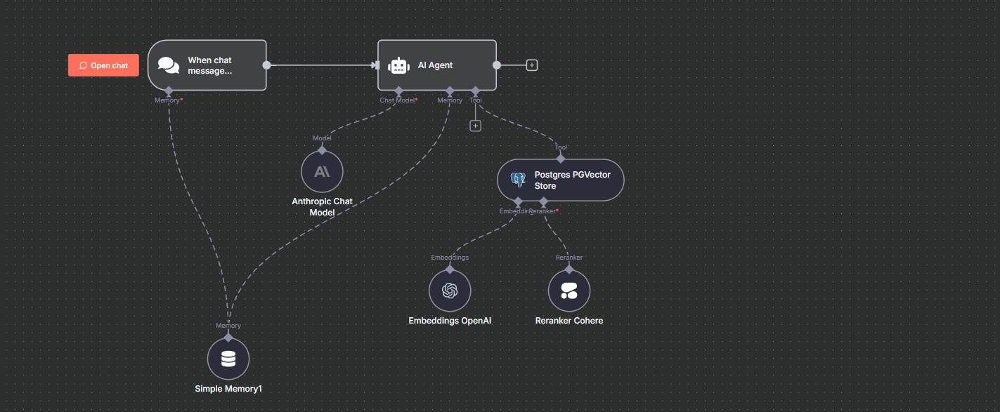

# Hudu Chatbot (n8n)

A lookup-only chatbot that retrieves Hudu knowledge (Cheat Sheets & Important Info) with RAG and safe fallbacks.

## Highlights
- **Hudu-first search**: every message is treated as a KB/Important Info lookup.
- **Cheat Sheet → POC priority** with strict formatting.
- **Vector store** in Postgres + confidence thresholds.
- **Fallback** to Hudu API if retrieval is low-confidence or empty.
- **Model**: Gemini (configurable; GPT-4o supported).
- **Embed**: simple Edge/Chrome extension with an iframe.

## Live Demo
- (Add your public n8n chat URL or a short Loom walkthrough.)

## Architecture
1. **chatTrigger (n8n)** receives message → policy routing.
2. **RAG search** (Postgres Vector Store) with company/section filters.
3. **Policy enforcement** (Cheat Sheet POC priority; Important Info for services/vendors/etc.).
4. **Fallback**: Hudu API (company page or article) if no confident match.
5. **Response**: returns original KB snippet **verbatim** + **source URL**.

## Retrieval Policy (abridged)
- **POC**: Use `Cheat Sheet - {Company}` → `📞 Points of Contact` (verbatim). Fallback to Important Info → POC.
- **Support Services / Access / Vendors / Warranty / Address / Notes**: Use **Important Info**.
- If not found: respond with `Not found in Cheat Sheet or Important Info for {Company}. Not found`.

## Screenshots
- Workflow: 
- Vector node: 
- Policy prompt: 
- Hudu result: 
- Edge extension: 
- Logs: 

## Setup
1. **n8n**: import workflow JSON; set credentials (Postgres, Hudu API, model provider).
2. **Vector store**: run ingestion workflow to populate `hudu_kb` (metadata includes `company`, `url`, `type`, `updated_at`).
3. **Policy prompt**: paste the retrieval policy into your system/instruction node.
4. **Edge/Chrome extension**: load unpacked and set iframe URL to your n8n chat endpoint.

## Repo Structure
